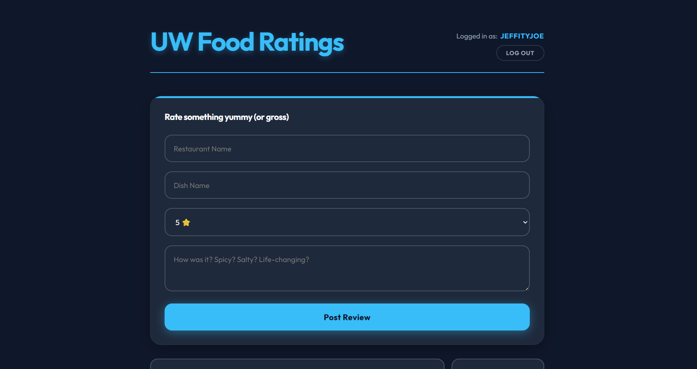
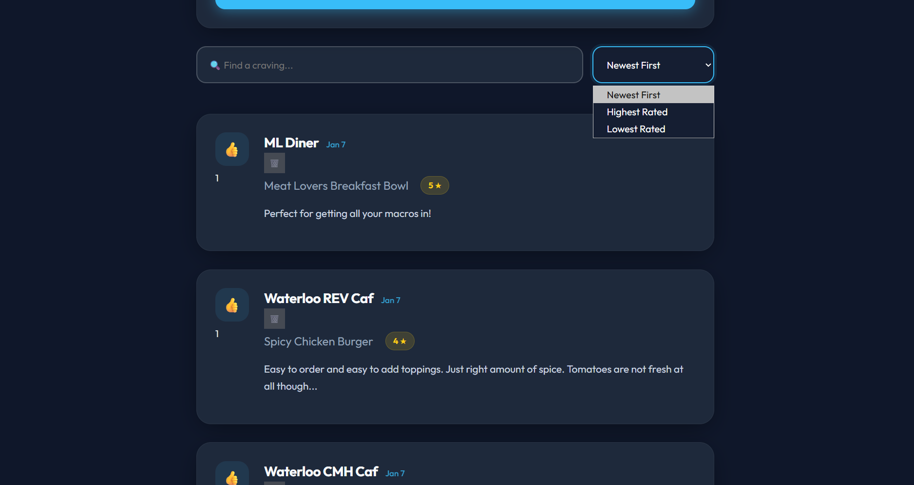

# UW Food Ratings

A small full-stack app for rating food from restaurants around University of
Waterloo. Users sign up, post reviews (restaurant, dish, star rating, comment),
upvote other people's reviews, and delete their own. Built as a portfolio project
to practice a real auth flow (bcrypt + JWT) end-to-end, not just CRUD.

## Stack

**Backend** — Java 21, Spring Boot 4.0 (`spring-boot-starter-webmvc`,
`spring-data-jpa`), PostgreSQL, `jjwt` for token signing/verification,
`spring-security-crypto` for BCrypt (no full Spring Security filter chain —
auth is a plain servlet `Filter`, see below).

**Frontend** — React 19 + TypeScript, Vite, React Router, Axios. Plain CSS,
no UI framework.

**Deployment** — Dockerized backend (`backend/Dockerfile`), deployed alongside
the frontend and a managed Postgres instance on Render.

## How auth works

- `POST /api/auth/register` hashes the password with `BCryptPasswordEncoder`
  before saving. `POST /api/auth/login` verifies with `passwordEncoder.matches()`
  and, on success, returns a signed JWT (`{ token, userId, username }`) — not
  the user object.
- The frontend stores the token in `localStorage` and sends it as
  `Authorization: Bearer <token>` on every request to a protected endpoint.
- `JwtAuthFilter`, a plain `OncePerRequestFilter`, validates the token before
  the request reaches any controller and stores the authenticated userId as a
  request attribute. Controllers read the userId from that attribute — never
  from a client-supplied parameter — so there's no way to act as another user
  by editing a request.
- Deleting a rating checks the JWT-derived userId against the rating's owner
  and returns 403 on a mismatch. There is no special-cased user ID with
  override permissions.

The full writeup of *why* it's built this way (BCrypt vs. a fast hash, what a
JWT signature actually prevents, why the old `userId` param was spoofable) is
in [`DESIGN.md`](./DESIGN.md).

## API

| Method | Path                        | Auth required | Notes                                  |
|--------|-----------------------------|:---:|------------------------------------------------|
| POST   | `/api/auth/register`        | –   | Body: `{ username, password }`                  |
| POST   | `/api/auth/login`           | –   | Returns `{ token, userId, username }`           |
| GET    | `/api/ratings`               | –   | List all ratings                                |
| POST   | `/api/ratings`               | ✔   | Body: `{ restaurantName, dishName, stars, comment }` — `userId` comes from the JWT, not the body |
| PUT    | `/api/ratings/{id}/upvote`   | ✔   | One vote per user per rating (enforced via a `Vote` join table) |
| DELETE | `/api/ratings/{id}`          | ✔   | 403 if the authenticated user doesn't own the rating |

Protected routes expect `Authorization: Bearer <token>`; a missing or invalid
token gets a 401 before the request reaches the controller.

## Running it locally

**Prerequisites:** JDK 21, Node.js, a local PostgreSQL instance.

1. Create a local database:
   ```bash
   createdb uwfoodratings
   ```

2. Backend (from `backend/`):
   ```bash
   ./mvnw spring-boot:run
   ```
   Reads config from `backend/src/main/resources/application.properties`,
   which defaults to a local Postgres on `localhost:5432` with user `postgres`.
   Override via environment variables if your setup differs:

   | Variable | Default | Purpose |
   |---|---|---|
   | `DB_URL` | `jdbc:postgresql://localhost:5432/uwfoodratings` | JDBC connection string |
   | `DB_USERNAME` | `postgres` | DB user |
   | `DB_PASSWORD` | `postgres` | DB password |
   | `PORT` | `8080` | Server port |
   | `JWT_SECRET` | a placeholder dev value | HMAC signing key for JWTs — **must** be overridden with a real secret outside local dev |
   | `JWT_EXPIRATION_MS` | `86400000` (24h) | Token lifetime |

3. Frontend (from `frontend/`):
   ```bash
   npm install
   npm run dev
   ```
   Reads `VITE_API_BASE_URL` from `frontend/.env` (defaults to
   `http://localhost:8080`). Visit `http://localhost:5173`.

## Tests

```bash
cd backend
./mvnw test
```

Covers: register→login round trip (and that the stored password is actually
hashed), login rejection on a wrong password, protected endpoints rejecting
missing/invalid JWTs, and a user being blocked (403) from deleting someone
else's rating.

## Screenshots

### Posting a review


### Feed

